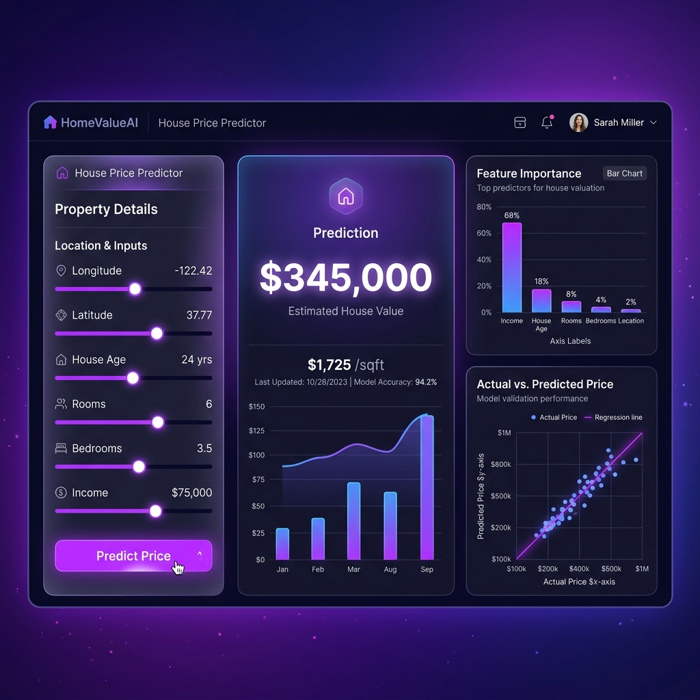

# 🏠 House Price Prediction App

An interactive machine learning web application that predicts California house prices based on property features.



## 🚀 Live Demo
[👉 Click here to open the Live App](https://house-price-prediction-4gndjxxfnmnd5nwd4rf8vf.streamlit.app/)

## 📸 Features
- 🔮 **Real-time price prediction** using a trained Random Forest model
- 📊 **Model performance dashboard** — Actual vs Predicted, feature importances
- 🔍 **Data insights** — price distributions, correlation heatmap, dataset explorer
- 🎨 Premium dark UI design

## 📁 Project Structure
```
House-Price-Prediction/
├── .github/
│   └── workflows/
│       └── ci.yml      # CI/CD test workflow
├── data/
│   └── housing_new.csv # Dataset (California Housing)
├── src/
│   └── main.py         # Streamlit web app source code
├── notebooks/
│   └── HousePricePredictionProject.ipynb # Experimentation notebook
├── tests/
│   └── test_app.py     # Automated unit tests
├── images/
│   └── dashboard_mockup.png # Visualization screenshot
├── .gitignore          # Git ignore file
├── Dockerfile          # Container configuration
├── LICENSE             # MIT License
├── CONTRIBUTING.md     # Development setup guide
├── README.md           # Project documentation
└── requirements.txt    # Python dependencies
```

## 📦 Tech Stack
| Tool | Purpose |
|------|---------|
| `Streamlit` | Web app framework |
| `scikit-learn` | Random Forest model |
| `pandas` | Data manipulation |
| `matplotlib / seaborn` | Visualizations |
| `pytest` | Testing framework |
| `docker` | Containerization |

## ▶️ Run Locally
```bash
# Install dependencies
pip install -r requirements.txt

# Run the app from the root directory
streamlit run src/main.py
```

## 🐳 Docker Deployment
You can build and run this application inside a Docker container:

```bash
# Build the Docker image
docker build -t house-price-predictor .

# Run the container
docker run -p 8501:8501 house-price-predictor
```
Open `http://localhost:8501` in your browser to access the app.

## 🧪 Testing
We use `pytest` for unit testing the model training and loading code:
```bash
# Run all tests
pytest
```

## 🤖 Model Details
- **Algorithm**: Random Forest Regressor (100 trees)
- **Train/Test Split**: 80% / 20%
- **Preprocessing**: StandardScaler + One-Hot Encoding
- **Target**: `median_house_value` ($)
- **Features**: longitude, latitude, housing age, rooms, bedrooms, population, households, income, ocean proximity
